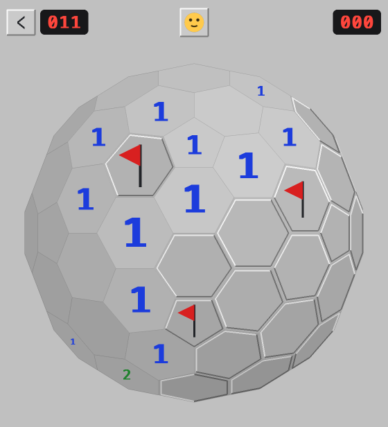
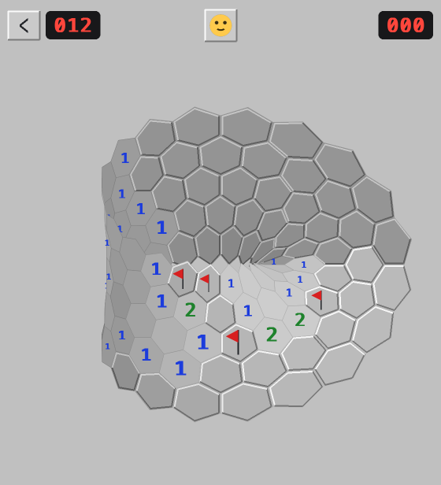
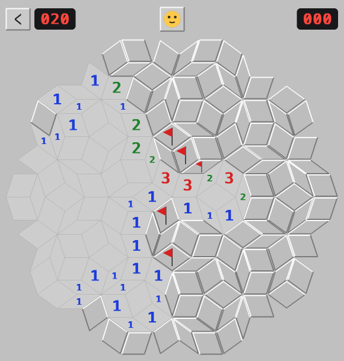
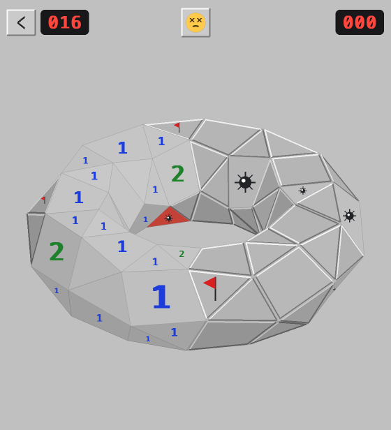

# Minesweeper

Classic minesweeper, but the board can be almost any surface and tiling —
from a flat aperiodic Penrose mosaic to a fullerene sphere or a Möbius strip.

<table>
  <tr>
    <td align="center"><br>C180 fullerene on a sphere</td>
    <td align="center"><br>Hexagons on a Möbius strip</td>
  </tr>
  <tr>
    <td align="center"><br>Penrose rhombi</td>
    <td align="center"><br>Snub square on a donut (boom)</td>
  </tr>
</table>

Pick a surface, then a tiling:

- **Flat surface** — classic squares (8 neighbors), a big triangle
  subdivided into small triangles (12), a triangle grid (12), hexagons
  (6), a big hexagon composed of small hexagons (6), an aperiodic
  Penrose tiling (P3 rhombi), and the six Archimedean tilings with two
  tile shapes: elongated triangular 3.3.3.4.4, snub square 3.3.4.3.4,
  trihexagonal/kagome 3.6.3.6, snub hexagonal 3.3.3.3.6, truncated
  square 4.8.8, and truncated hexagonal 3.12.12
- **Sphere (3D)** — 60 pentagons (a pentagonal hexecontahedron, 7
  neighbors), a C80 fullerene (12 pentagons + 30 hexagons), a C180
  fullerene (12 pentagons + 80 hexagons), 80 geodesic triangles, or a snub dodecahedron
  (12 pentagons + 80 triangles).
  (A sphere cannot be tiled with hexagons alone — Euler's formula
  forces 12 pentagons in.)
- **Polyhedra (3D)** — a cube tiled with squares (6 faces), or a
  tetrahedron tiled with triangles (4 faces); cells stitch across the
  edges where faces meet
- **Donut (3D)** — squares, triangles, or pure hexagons (possible
  because the torus has Euler characteristic 0); the grid wraps in
  both directions, so there are no border cells
- **Möbius strip (3D)** — squares, triangles, or hexagons on a
  one-sided surface; the strip glues to itself with a flip
- **Cylinder (3D)** — squares, triangles, or hexagons around an open
  tube

## Play

**In the browser:** <https://sirk0.github.io/minesweeper-tiles/>
(built with [pygbag](https://pygame-web.github.io), deployed from master
by GitHub Actions)

On the desktop:

```sh
pip install -r requirements.txt
python3 -m minesweeper
```

The menu picks a topology, then one of its tilings and a difficulty.
In game:

- **Left-click** — reveal a cell (the first reveal is always safe);
  left-click a revealed number to chord
- **Right-click** — toggle a flag
- **Face button** or `n` — new game
- `1` / `2` / `3` — switch to easy / medium / hard
- **`<` button** or `Escape` — back to the menu

On 3D boards, **drag** with the left button (or use the arrow keys) to
rotate the surface; a short click reveals.

`python3 -m minesweeper --mode hex [difficulty]` skips the menu.

## Development

```sh
make venv     # create .venv with every dependency group
make test     # run the test suite
make lint     # ruff
make run      # desktop game
make web-run  # browser version at http://localhost:8000
make help     # everything else
```

Dependency groups live in `pyproject.toml` (`web`, `test`, `all`) with
locked `requirements*.txt` files regenerated by `make lock` (uv).

Tests run headless via SDL's dummy video driver.

Code layout: `minesweeper/game.py` holds the rules over an arbitrary
cell graph; `minesweeper/boards.py` generates the tilings (cell
vertices get exact hashable ids — lattice points in 2D, symbolic keys
in 3D — and two cells are neighbors when they share a vertex); the
sphere is built with the Conway gyro operation on an icosahedron;
`minesweeper/gui.py` is the pygame interface, including the rotatable
orthographic 3D view.
